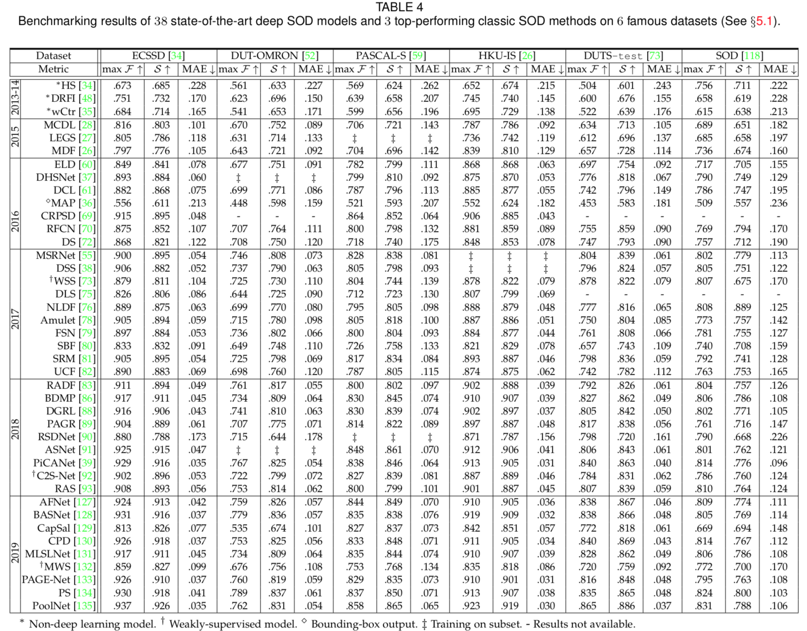

# Salient Object Detection in the Deep Learning Era: An In-Depth Survey

===========================================================================

[Wenguan Wang](https://sites.google.com/view/wenguanwang), Qiuxia Lai, Huazhu Fu, Jianbing Shen, Haibin Ling

===========================================================================

Google Disk: https://drive.google.com/open?id=1WSmPaUV909uWF3ycL0MLWPWM6MdSjaJ0

Baidu Disk: https://pan.baidu.com/s/1f63o_QV4za6cdcigHSwhWw extraction code：jp53

Here include the saliency prediction maps for 37 major deep salient object detection (SOD) methods, a constructed dataset with annotations for attribute analysis, and codes for evaluation (see our paper for details). 

1. Saliency prediction maps
  DUT.rar (DUT-OMRON dataset)
  DUTSTE.rar (test set of DUTS dataset)
  ECSSD.rar (ECSSD dataset)
  HKU-IS.rar (HKU-IS dataset)
  PASCAL-S.rar (PASCAL-S dataset)
  SOD.rar (SOD dataset)
    
2. Dataset and annotations for attribute analysis
  The hybrid dataset consists of 1,800 images randomly selected from 6 datasets, namely SOD, ECSSD, DUT-OMRON, PASCAL-S, HKU-IS and  the  test  set  of  DUTS (300  for  each). We carefully exclude images in ECSSD that also appear in SOD.
  
  The annotations listed in ATTR_anno.xlsx cover 16 attributes from the perspectives of salient object categories, challenges and scene categories. 
  
3. Codes for evaluation
  Matlab codes for calculating F-max, S-measure and MAE.  
  
  

===========================================================================

Citation:

	@article{wang2019sodsurvey,
  		title={Salient Object Detection in the Deep Learning Era: An In-Depth Survey},
  		author={Wang, Wenguan and Lai, Qiuxia and Fu, Huazhu and Shen, Jianbing and Ling, Haibin},
  		journal={arXiv preprint arXiv:1904.09146},
  		year={2019},
	}
	
If you find our dataset is useful, please cite above paper.

===========================================================================

Contact Information

Email:

wenguanwang.ai@gmail.com

qxlai@cse.cuhk.edu.hk
